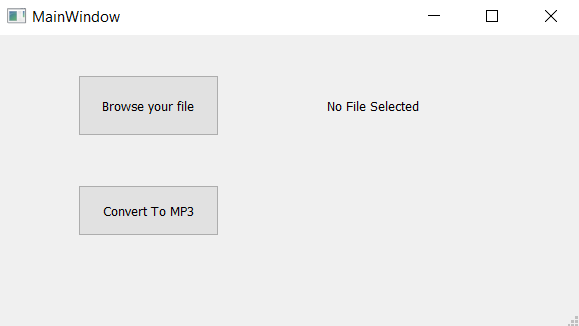
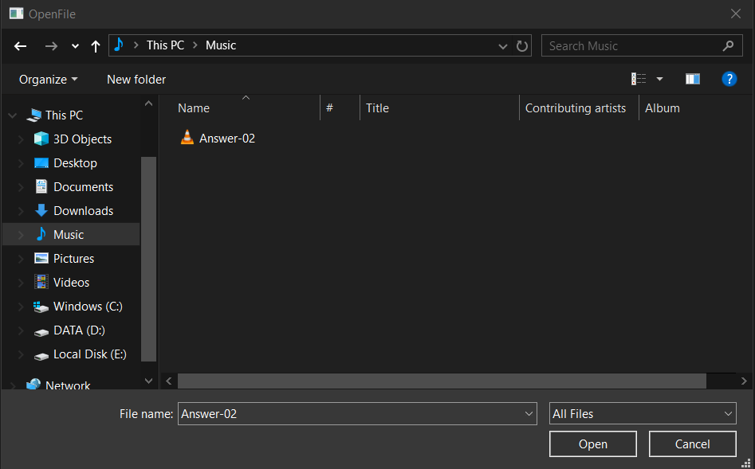
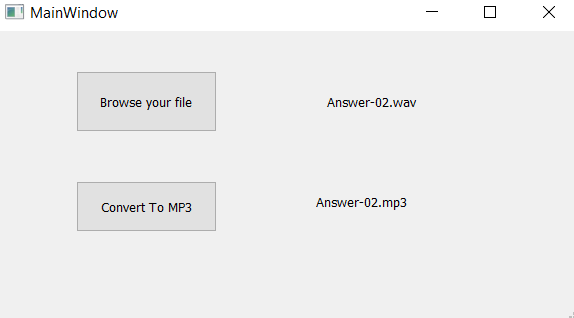
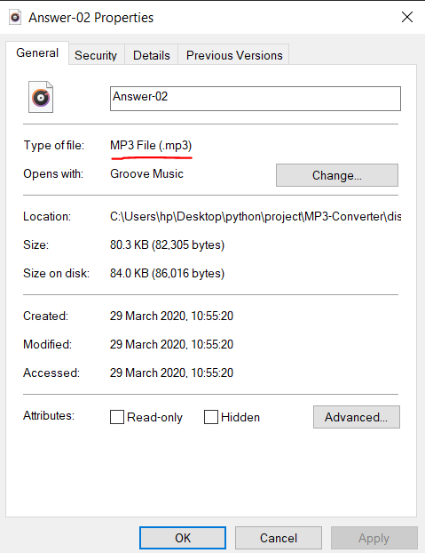

# MP3 Converter
 
 >  **MP3 is one of the most popular coding and file formats for compressing digital audio. It was initially defined as the third audio format of the MPEG-1 standard, but further extensions made it the third format of the MPEG-2 standard.**    

# Why MP3?

> - One of the most notable advantages of MP3 is reduced file size.  
> - The size is often smaller by a factor of 12 when compared to the standard CD Digital Audio.  
> - MP3 formats are compact i.e compressed when compared to the original format.  
> - Due to small size hundreds and thousands of songs can be stored.

# How to Use?

>  **A Simple approach to Convert your Audio File.**   

>  **Browse your file**   

>  **Select the audio file for formatting** 

>  **Select to Covert the audio to MP3** 

>  **The new MP3 file is generated** 

