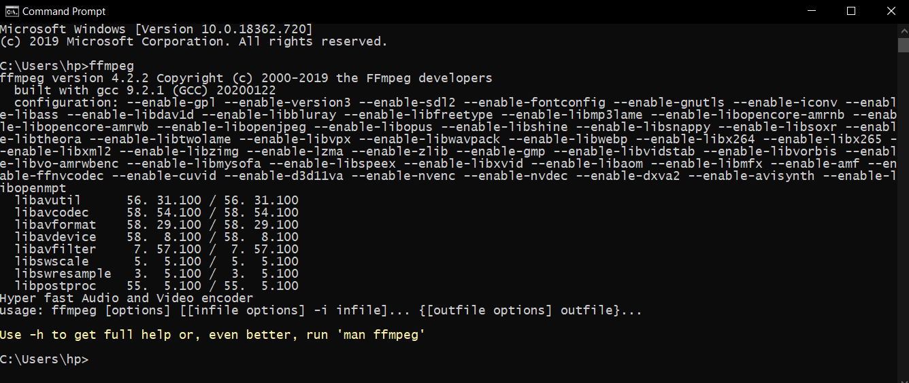

# MP3 Converter
 
 >  **MP3 is one of the most popular coding and file formats for compressing digital audio. It was initially defined as the third audio format of the MPEG-1 standard, but further extensions made it the third format of the MPEG-2 standard.**    

# Why MP3?

> - One of the most notable advantages of MP3 is reduced file size.  
> - The size is often smaller by a factor of 12 when compared to the standard CD Digital Audio.  
> - MP3 formats are compact i.e compressed when compared to the original format.  
> - Due to small size hundreds and thousands of songs can be stored.

# How to Use?

>  **A Simple approach to Convert your Audio File.**   

>  **Browse your file**   

>  **Select the audio file for formatting** 

>  **Select to Covert the audio to MP3** 

>  **The new MP3 file is generated** 

# Setting Up ffmpeg:

> Download static build: https://ffmpeg.zeranoe.com/builds/  
>   
> After extracting the downloaded file, open the bin folder inside the extracted file: 

> Go to Start and type "Env" and select "Edit System Environment Variables" and Select on Environment Variables: 

> Select Path and click Edit: 

> Click on New to copy the path of bin folder here, then press ok until you exit the setting box 

> Open Command Prompt and type "ffmpeg":  

> If you are able to see the details like this, then you have appropriately set the ffmpeg and can now use this software.

# Libraries Used

> - Pydub  = For Audio formatting and exporting  
> - Pathlib = Object-oriented filesystem paths.  
> - PyQt5 =  GUI for python  

# Note

>  **This is an initial release and may contain bugs while running. All the suggestions and modifications are welcome as this is a public repo.  
> Preferable to download the initial python code and run it in the python environment in case you are facing any difficulties while running the executable version of the software.**   

